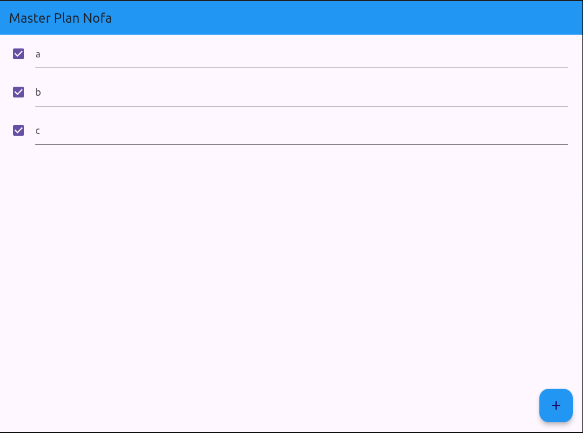

# **Pratikum 1**
# HASIL

# Penjelasan Maksud Langkah 4: Membuat data_layer.dart
berfungsi untuk mengelola beberapa model dalam satu tempat ekspor. Dengan membuat data_layer.dart,  hanya perlu melakukan satu kali impor untuk mengakses kedua model plan.dart dan task.dart.

# Alasan Penggunaan Variabel plan sebagai Konstanta pada Langkah 6
Variabel plan di langkah ini dibuat sebagai konstanta karena nilai-nilainya dianggap tidak akan berubah selama aplikasi berjalan. Dengan menetapkannya sebagai konstanta (const),  mendapatkan performa yang lebih baik dan memastikan nilai ini tidak sengaja diubah, sehingga kode menjadi lebih aman dan mudah dipelihara.

# Kegunaan Metode pada Langkah 11 dan 13 dalam Lifecycle State
- **Langkah 11 (Metode initState):** initState adalah bagian dari siklus hidup Flutter yang dipanggil satu kali ketika widget pertama kali dimuat. Pada langkah ini, scrollController ditambahkan dengan listener agar ketika pengguna menggulir halaman, fokus pada TextField atau input lain akan hilang. Hal ini meningkatkan UX dengan memastikan keyboard otomatis menyembunyikan ketika layar digulir.
- **Langkah 13 (Metode dispose):** dispose berguna untuk menghapus scrollController dari memori ketika widget sudah tidak digunakan. Tanpa metode ini, widget dapat mengalami kebocoran memori karena controller tetap berada dalam memori meskipun tidak digunakan lagi.

# **Pratikum 2**
# HASIL

# Penjelasan InheritedWidget pada Langkah 1 dan Alasan Penggunaan InheritedNotifier
- **InheritedWidget  adalah PlanProvider**, yaitu kelas yang diturunkan dari InheritedNotifier. InheritedWidget dalam Flutter digunakan untuk berbagi data antar widget di dalam hirarki widget tanpa harus mengirimkan data secara manual ke setiap widget.

- **Pada PlanProvider, yang digunakan adalah InheritedNotifier dan bukan InheritedWidget biasa**, karena InheritedNotifier memiliki kemampuan untuk memperbarui widget yang bergantung padanya saat data berubah. InheritedNotifier ini berguna dalam kasus di mana kita memiliki data yang mungkin berubah, seperti pada aplikasi ini yang memiliki daftar tugas (tasks) yang statusnya (lengkap atau belum lengkap) dapat berubah. ValueNotifier digunakan sebagai notifier untuk mengemas data Plan agar dapat diubah secara real-time, sehingga setiap perubahan dalam Plan langsung diperbarui di semua widget yang menggunakan PlanProvider.